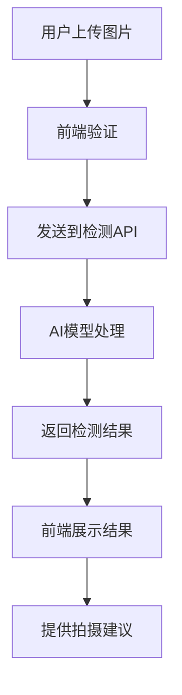

# 绝缘子裂痕检测系统架构

## 项目概述

这是一个基于 Next.js 14 + TypeScript 的绝缘子裂痕检测前端系统，提供智能的图像检测和分析功能。

## 技术栈

- **前端框架**: Next.js 14 (App Router)
- **开发语言**: TypeScript
- **样式方案**: Tailwind CSS
- **状态管理**: React Hooks
- **HTTP客户端**: Axios
- **通知组件**: React Hot Toast
- **图标库**: Lucide React

## 项目结构

```
src/
├── app/                    # Next.js App Router
│   ├── api/               # API 路由
│   │   └── detect/        # 检测接口
│   ├── layout.tsx         # 根布局
│   ├── page.tsx           # 主页面
│   └── globals.css        # 全局样式
├── components/            # 复用组件 (待扩展)
└── lib/                   # 工具函数 (待扩展)
```

## 核心功能

### 1. 智能图像上传
- 支持文件拖拽上传
- 支持相机拍照上传
- 自动图像预览
- 文件类型验证

### 2. 裂痕检测
- 基于AI的裂痕识别
- 置信度评分
- 裂痕位置标记
- 检测结果可视化

### 3. 拍摄建议
- 检测失败时提供优化建议
- 智能分析拍摄条件
- 用户指导功能

### 4. 验证面板
- API请求/响应查看
- 开发验证支持
- 性能监控

## 数据流



## API 接口

### 检测接口 `/api/detect`

**请求方式**: POST (multipart/form-data)
**参数**:
- `image`: 图片文件

**响应格式**:
```json
{
  "success": true,
  "cracks": [
    {
      "x": 150,
      "y": 200,
      "width": 45,
      "height": 12,
      "confidence": 0.87
    }
  ],
  "suggestions": [
    "建议在明亮的光线下拍摄"
  ]
}
```

## 部署架构

- **开发环境**: Next.js 开发服务器
- **生产环境**: Docker 容器化部署
- **CI/CD**: 自动化构建和部署

## 性能优化

- 图片智能压缩
- 双通道检测 (上传/Base64兜底)
- 懒加载和代码分割
- CDN 资源优化

## 扩展计划

- [ ] 用户认证系统
- [ ] 历史记录管理
- [ ] 批量检测功能
- [ ] 移动端适配
- [ ] PWA 支持
